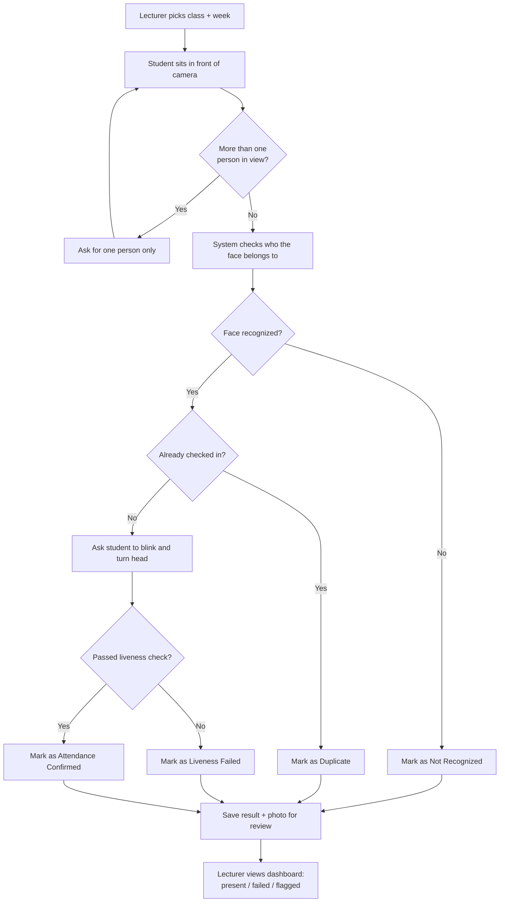
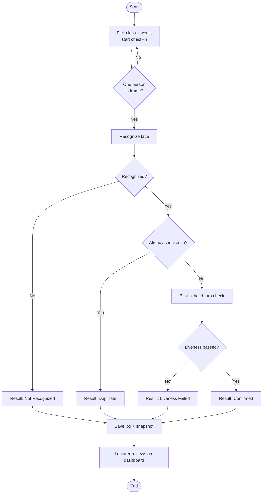
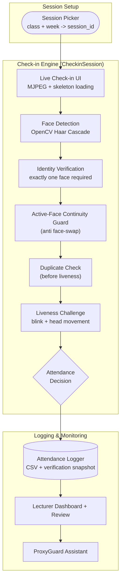
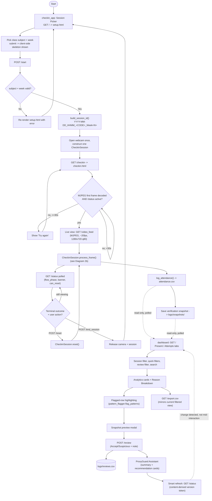
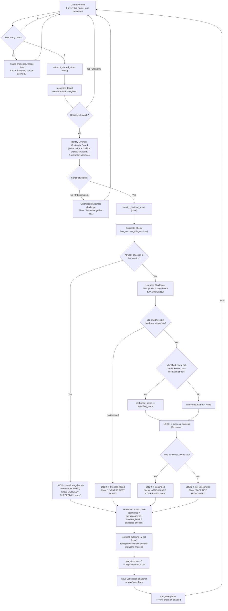
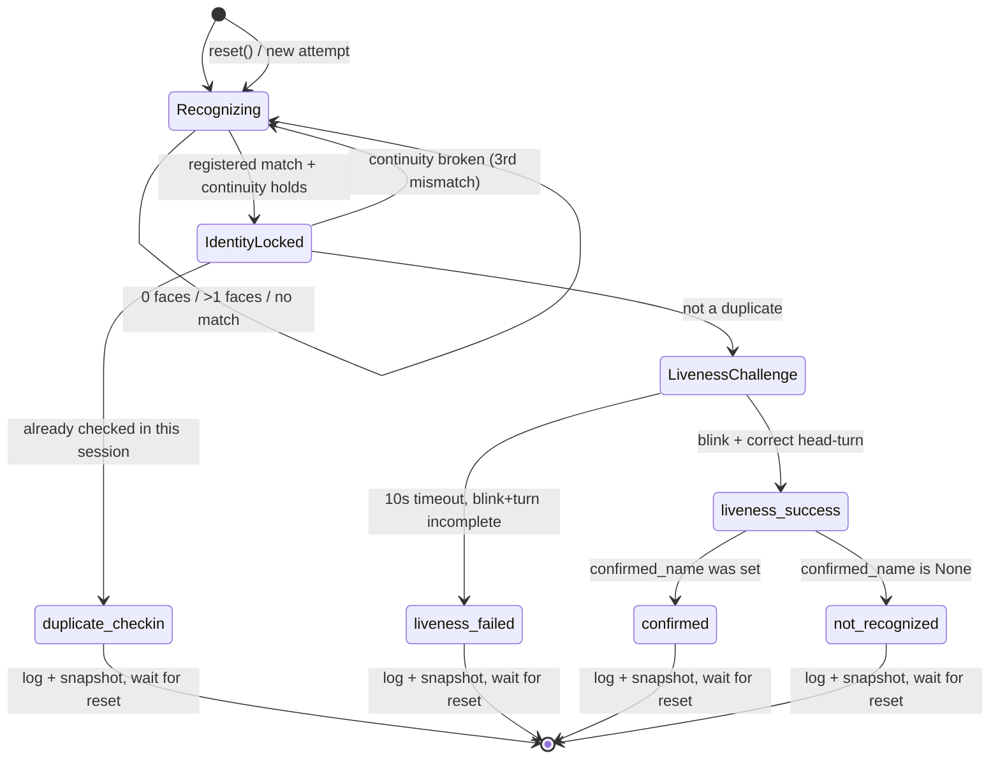

# System Flowchart

Visualizes the main ProxyGuard flow end to end: session picking (`checkin_app`), the shared check-in engine (`CheckinSession` in `src/main.py`), and lecturer dashboard monitoring (`dashboard/`). Evaluation Mode is intentionally excluded — see [[architecture]] for that feature if needed.

Two representations of the same flow are given below: a text-based (ASCII) diagram, and Mermaid source. Both are kept in sync with the real routes/states in `checkin_app/app.py`, `src/main.py`, and `dashboard/app.py` — update both if the flow changes. See [[architecture]] for prose detail and [[decisions]] for why each safeguard exists.

## 0. Simple Overview (plain language)

A quick, non-technical version of the same flow — good for a presentation slide or explaining the system to someone who isn't reading the code.

```
[Lecturer picks class + week]
            |
            v
[Student sits in front of the camera]
            |
            v
      More than one
      person in view? -- yes --> [Ask for one person only] --> (wait)
            |
            no
            |
            v
[System checks who the face belongs to]
            |
            v
      Face recognized? -- no --> [Mark as "Not Recognized"]
            |
            yes
            |
            v
[Already checked in today?] -- yes --> [Mark as "Duplicate"]
            |
            no
            |
            v
[Ask the student to blink and turn their head]
            |
            v
      Passed the
      liveness check? -- no --> [Mark as "Liveness Failed"]
            |
            yes
            |
            v
[Mark as "Attendance Confirmed"]
            |
            v
[Save the result + a photo for the lecturer to review later]
            |
            v
[Lecturer opens the dashboard: sees who's present,
 who failed, and can flag anything suspicious]
```



## 0.5 Compact Report Diagram (standard shapes, short and wide)

A shorter, single-page version for pasting into the report as a figure — standard flowchart shapes only (stadium = start/end, rectangle = process/action, diamond = decision), one path top to bottom with no side loops.



## 0.7 Architecture Pipeline Diagram

A single-path, top-to-bottom pipeline view of the same system — one box per major stage, grouped into the three logical layers (session setup, the check-in engine, and post-attempt logging/monitoring). Good for a "how the pieces connect" slide, as opposed to the decision-by-decision flowcharts above.

### Boxed pipeline (text-based)

```
┌───────────────────────────────────────────────────┐
│                   SESSION SETUP                    │
│   Session Picker  (class + week → session_id)      │
└────────────────────────┬────────────────────────────┘
                          │
                          ▼
┌───────────────────────────────────────────────────┐
│                  LIVE CHECK-IN UI                   │
│   MJPEG video stream + skeleton loading state       │
└────────────────────────┬────────────────────────────┘
                          │
                          ▼
┌───────────────────────────────────────────────────┐
│                   FACE DETECTION                    │
│              OpenCV Haar Cascade                    │
└────────────────────────┬────────────────────────────┘
                          │
                          ▼
┌───────────────────────────────────────────────────┐
│               IDENTITY VERIFICATION                 │
│           exactly one face required                 │
└────────────────────────┬────────────────────────────┘
                          │
                          ▼
┌───────────────────────────────────────────────────┐
│         ACTIVE-FACE CONTINUITY GUARD                │
│                  (anti face-swap)                    │
└────────────────────────┬────────────────────────────┘
                          │
                          ▼
┌───────────────────────────────────────────────────┐
│                  DUPLICATE CHECK                     │
│              (runs before liveness)                  │
└────────────────────────┬────────────────────────────┘
                          │
                          ▼
┌───────────────────────────────────────────────────┐
│                LIVENESS CHALLENGE                    │
│            blink  +  head movement                   │
└────────────────────────┬────────────────────────────┘
                          │
                          ▼
                    ◇ ATTENDANCE ◇
                    ◇  DECISION  ◇
                          │
                          ▼
┌───────────────────────────────────────────────────┐
│                 ATTENDANCE LOGGER                     │
│      CSV row  +  verification snapshot (.jpg)         │
└────────────────────────┬────────────────────────────┘
                          │
                          ▼
┌───────────────────────────────────────────────────┐
│           LECTURER DASHBOARD + REVIEW                 │
└────────────────────────┬────────────────────────────┘
                          │
                          ▼
┌───────────────────────────────────────────────────┐
│                PROXYGUARD ASSISTANT                   │
└───────────────────────────────────────────────────┘
```

### Mermaid version



## 1. Text-based (ASCII) flow

```
[START]
   |
   v
==================================================================
 CHECKIN_APP: SESSION PICKER  (GET / -> setup.html)
==================================================================
   |
   v
[Lecturer/operator picks class subject + week (1-14)]
   |
   v
[Submit -> client-side skeleton shown immediately
 (shimmer placeholders, "Preparing check-in session...")]
   |
   v
[POST /start]
   |
   v
<subject + week valid against CLASS_SUBJECTS / WEEK_MIN..WEEK_MAX?>
   |
   |-- No --> re-render setup.html with an error --> back to SESSION PICKER
   |
   +-- Yes
         |
         v
       [build_session_id(subject, week) = YYYY-MM-DD_HHMM_<CODE>_Week<N>]
       [Station: open webcam once, construct ONE CheckinSession
        (loads known_faces encodings, opens its own mediapipe FaceMesh)]
         |
         v
       [Redirect -> GET /checkin  (checkin.html)]


==================================================================
 CHECKIN_APP: LIVE CHECK-IN PAGE
==================================================================
   |
   v
[Skeleton shown by default on this page too]
   |
   v
<MJPEG  decoded first frame (load event)
 AND /status reports station active?>
   |
   |-- No, within 30s --> keep waiting (poll /status)
   |-- No, after 30s  --> show "Try again" failure state
   |
   +-- Yes --> hide skeleton, show live view
         |
         v
       [GET /video_feed: MJPEG stream, ~20 FPS, 1280x720 JPEG q80]
       [each frame -> CheckinSession.process_frame(frame)]
         |
         v
       (see Section 2 below: CheckinSession per-frame flow --
        this is where recognition/liveness/logging/snapshot all happen)
         |
         v
       [GET /status polled by the page: flow_phase / banner text /
        can_reset -- drives the visible message + button state]
         |
         v
       <Terminal outcome reached AND lecturer/student clicks
        "New check-in" (POST /reset)?>
         |
         |-- Yes --> same CheckinSession.reset() --> fresh attempt
         |            --> back to CheckinSession per-frame flow
         |
         +-- No --> stays on terminal screen
         |
         v
       <"End session" clicked (POST /end_session)?>
         |
         +-- Yes --> release camera + CheckinSession --> back to SESSION PICKER


==================================================================
 SECTION 2: CheckinSession PER-FRAME FLOW (src/main.py)
 -- shared identically by checkin_app/ AND the desktop entry point --
==================================================================
   |
   v
[Face Detection] -- every 3rd frame only (face_recognition, 0.25x scale)
   |
   v
<How many faces?>
   |
   |-- 0 faces ---------------------------------------> loop (next frame)
   |
   |-- more than 1 face
   |     |
   |     v
   |   [PAUSE challenge: freeze countdown, discard partial match]
   |   [Show: "Only one person allowed in frame, please
   |          ensure you are alone during check-in"]
   |     |
   |     +---------------------------------------------> loop (next frame)
   |
   +-- exactly 1 face
         |
         v
       [attempt_started_at set once (first usable single-face frame)]
       [Identity Verification: recognize_face(), tolerance 0.45, margin 0.1]
         |
         v
       <Registered match found?>
         |
         |-- No ("Unknown") --------------------------> loop (next frame)
         |
         +-- Yes
               |
               v
             [Identity-Liveness Continuity Guard]
             [same name as currently bound identity? position within
              35% of frame width of last confirmed position? up to 2
              consecutive mismatches tolerated before clearing]
               |
               v
             <Continuity holds?>
               |
               |-- No (3rd consecutive mismatch)
               |     |
               |     v
               |   [Clear identity, restart challenge from scratch]
               |   [Show: "Face changed or lost, please keep the
               |          same face in frame"]
               |     |
               |     +-------------------------------> loop (next frame)
               |
               +-- Yes
                     |
                     v
                   [identity_decided_at set once; identified_name /
                    last_known_name updated]
                   [Duplicate Check: has_success_this_session(name,
                    session_id) -- reused from attendance_logger.py]
                     |
                     v
                   <Already checked in successfully this session?>
                     |
                     |-- Yes
                     |     |
                     |     v
                     |   [LOCK -> duplicate_checkin]
                     |   [Liveness challenge SKIPPED entirely]
                     |   [Show: "ALREADY CHECKED IN: <name>"]
                     |     |
                     |     v
                     |   go to TERMINAL OUTCOME below
                     |
                     +-- No
                           |
                           v
                         [Liveness Challenge: continuous blink detection
                          (EAR < 0.21, >=2 consecutive frames) + randomized
                          head-turn (left/right/up), 10s window]
                         [challenge_started_at set once landmarks resolve]
                           |
                           v
                         <Blink AND correct head-turn within 10s?>
                           |
                           |-- No (10s elapses)
                           |     |
                           |     v
                           |   [LOCK -> liveness_failed]
                           |   [Show: "LIVENESS TEST FAILED"]
                           |     |
                           |     v
                           |   go to TERMINAL OUTCOME below
                           |
                           +-- Yes
                                 |
                                 v
                               <identified_name set, non-"Unknown", zero
                                current continuity-mismatch streak?>
                                 |
                                 |-- Yes --> confirmed_name := identified_name
                                 +-- No  --> confirmed_name := None
                                 |
                                 v
                               [LOCK -> liveness_success]
                               [Show "LIVENESS DETECTION SUCCESSFUL" for a
                                fixed 2s banner]
                                 |
                                 v (after 2s)
                               <Was confirmed_name set?>
                                 |
                                 |-- Yes --> [LOCK -> confirmed]
                                 |            [Show "ATTENDANCE CONFIRMED: <name>"]
                                 |            go to TERMINAL OUTCOME below
                                 |
                                 +-- No  --> [LOCK -> not_recognized]
                                              [Show "LIVENESS DETECTION
                                               SUCCESSFUL, BUT FACE NOT
                                               RECOGNIZED"]
                                              go to TERMINAL OUTCOME below


==================================================================
 TERMINAL OUTCOME
 -- reached from exactly one of: confirmed | not_recognized |
    liveness_failed | duplicate_checkin --
==================================================================
   |
   v
[terminal_outcome_at set once; recognition/liveness/decision
 duration_seconds finalized (time.monotonic() based)]
   |
   v
[log_attendance(name, result, reason, session_id)
 -> appends one row to logs/attendance.csv
 -> a "success" is downgraded to "failed" / "duplicate check-in this
    session" if a prior success already exists this session]
   |
   v
[Save verification snapshot: logs/snapshots/<session_id>_<name>_
 <reason>_<HHMMSS>.jpg -- pre-overlay frame, for manual lecturer review only]
   |
   v
[can_reset() becomes true -- "New check-in" enabled in checkin_app /
 'n' key on desktop]
   |
   v
back up to CHECKIN_APP: LIVE CHECK-IN PAGE (reset / end_session branch)


==================================================================
 INDEPENDENT, ONGOING: LECTURER DASHBOARD (dashboard/, port 5001)
 -- separate read-only Flask app, polls the same CSVs/snapshots;
    never writes to attendance.csv --
==================================================================
   |
   v
[GET / -- session filter (defaults to most recent session)]
   |
   v
[Present tab: result=success rows]     [Attempts tab: result=failed rows]
   |                                         |
   +------------------+----------------------+
                      |
                      v
       [Quick filters: All/Successful/Failed/Flagged/Unknown/
        Duplicate/Liveness Failed -- client-side chips]
       [Review-status filters: All/Unreviewed/Accepted/Suspicious]
       [Client-side search (persisted in localStorage)]
                      |
                      v
       [Analytics cards: totals, success rate, flagged/duplicate/
        unknown/liveness-failed counts -- session-wide]
       [Reason Breakdown bar chart]
                      |
                      v
       [Flagged-row highlighting -- reuses pattern_flagger.flag_patterns()
        (repeated failures / duplicate attempts / unrecognized clusters);
        no detection logic duplicated in the dashboard]
                      |
                      v
       [Inline snapshot thumbnail per row] --click--> [Snapshot preview
                      |                                modal: full image
                      |                                + row metadata]
                      v
       [Lecturer Review: Accept / Suspicious + note (POST /review)
        -- writes logs/reviews.csv only, never attendance.csv]
        [Review Summary: Unreviewed/Accepted/Suspicious counts]
                      |
                      v
       [ProxyGuard Assistant: rule-based summary (success-rate bar,
        attention level, main concern) + up to 5 prioritized
        recommendation cards, each with "View affected attempts" /
        "Open next unreviewed attempt" -- reuses the same filter chips]
                      |
                      v
       [Smart auto-refresh: GET /status polled; reloads only when a
        content-derived version token changes (row count + latest row
        + reviews.csv size + newest snapshot name); a change mid-
        interaction is deferred until the interaction ends]
                      |
                      v
       [GET /export.csv -- mirrors exactly the current filtered view]
```

## 2. Mermaid source

Renders on GitHub/GitLab or any Mermaid-aware viewer. Three diagrams: (a) the overall app-level flow across `checkin_app` and `dashboard`, (b) `CheckinSession`'s per-frame decision flow as a flowchart, (c) the same engine states as a compact state diagram.

### 2a. App-level flow



### 2b. `CheckinSession` per-frame flowchart



### 2c. Engine state diagram (compact)



## Related Documentation

- [[architecture]] — prose detail behind every box above.
- [[decisions]] — why each safeguard (continuity guard, duplicate-before-liveness, multi-face pause, etc.) was added.
- [[bugs]] — bugs found and fixed in this flow.
- [[report]] — Section 8.7 has an earlier, `CheckinSession`-only version of the ASCII flowchart (Fig. 2) for the IEEE report; this file supersedes it with the full app-level flow including `checkin_app`'s session picker and the dashboard.
